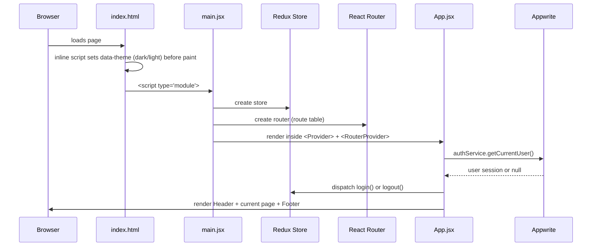
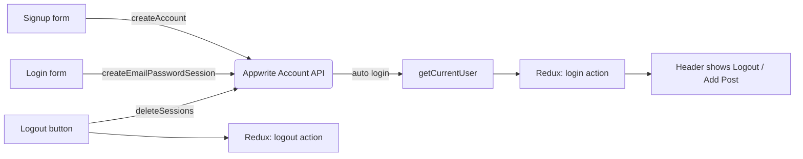
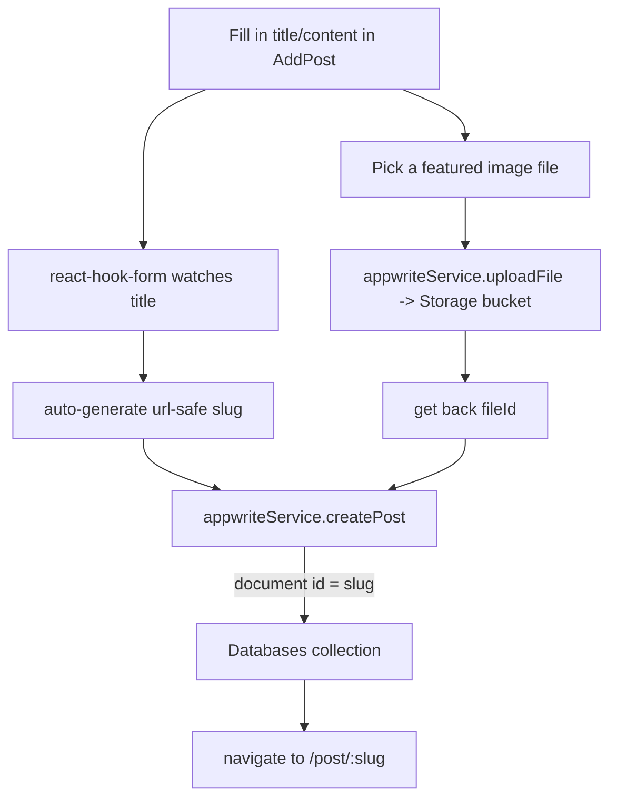

# flow.md — How "About Abir Hirani" Works

This document explains, from the ground up, how this blog is built and why. It assumes
no prior React/Appwrite knowledge — if you already know some of this, skip ahead.

---

## 1. What this project actually is

It's a **single-page application (SPA)**: one HTML file (`index.html`) loads a bundle
of JavaScript, and that JavaScript takes over the page completely — swapping content
in and out as you click around, without ever asking the server for a new HTML page.
That's what makes it feel instant, like an app rather than a website.

Two halves:

| Half | Technology | Lives where |
|---|---|---|
| **Frontend** (what you see/click) | React 19 + React Router + Redux Toolkit + Tailwind CSS | This repo, `src/` |
| **Backend** (data, accounts, files) | [Appwrite](https://appwrite.io) — a hosted "backend-as-a-service" | Not in this repo — it's a cloud service (or self-hosted server) you configure via `.env` |

You never write server code here. Appwrite already *is* the server: it gives you user
accounts, a database, and file storage over an HTTP API. Your React code just calls
that API using Appwrite's JavaScript SDK.

---

## 2. The full tech stack, and why each piece is here

- **React 19** — builds the UI out of small reusable pieces called *components*
  (a button, a post card, a whole page). When data changes, React figures out what to
  re-draw instead of you doing it by hand.
- **Vite** — the build tool / dev server. `npm run dev` starts a local server that
  rebuilds instantly as you save files. `npm run build` produces the optimized static
  files you'd deploy.
- **React Router (`react-router-dom`)** — maps URLs like `/post/my-slug` to a
  component to render, without a real page reload.
- **Redux Toolkit (`@reduxjs/toolkit`, `react-redux`)** — a small global store that
  holds *one* thing in this app: "is someone logged in, and who?" Any component,
  anywhere, can ask the store instead of passing that info down through props by hand.
- **Appwrite SDK (`appwrite`)** — talks to your Appwrite project for auth, database
  documents, and file storage.
- **React Hook Form (`react-hook-form`)** — manages form state/validation (login,
  signup, the post editor) without re-rendering on every keystroke.
- **TinyMCE (`@tinymce/tinymce-react`)** — the rich text editor used to write post
  content (bold, images, links, etc.), producing HTML.
- **html-react-parser** — takes that stored HTML string back out of the database and
  turns it into real React elements so it can be displayed safely and styled.
- **Tailwind CSS v4** — utility classes (`flex`, `rounded-xl`, `text-ink`) instead of
  hand-written CSS files. v4 is configured entirely in CSS now (see §7), no
  `tailwind.config.js` needed.
- **Three.js + `@react-three/fiber`** — renders the gold-streak WebGL shader that's
  now the site's permanent background (§13). React Three Fiber lets that shader be
  written as ordinary-looking React components (`<mesh>`, `<shaderMaterial>`)
  instead of hand-rolled imperative WebGL setup code.
- **`motion`** (Framer Motion's successor package) — drives the realistic parallax
  starfield layered on top of the shader (§13): spring-eased motion values that
  follow the pointer.
- **`cobe`** — a tiny WebGL dot-globe library. Installed, but the globe currently in
  use is a simpler CSS one; cobe only backs the archived alternate implementation
  (§13 explains why both exist).
- **`lucide-react`** — icon set used throughout the About Me dashboard and header.

---

## 3. Project map

```
Blog/
├── index.html            # the one real HTML file; loads main.jsx as a module
├── .env                  # YOUR secrets (Appwrite project info) — never commit this
├── .env.example           # template showing what .env needs
├── flow.md                # this file
├── functions/dashboard-data/  # optional Appwrite Function for live About Me widgets (§13)
├── scripts/               # one-time local setup helpers (Spotify OAuth, §13)
├── src/
│   ├── main.jsx            # entry point: sets up Redux + the router, renders <App/>
│   ├── App.jsx              # the shell: Header + background + page content (<Outlet/>) + Footer
│   ├── index.css            # design tokens, dark/light theme, global styles
│   ├── conf/conf.js          # reads Appwrite settings out of .env
│   ├── appwrite/
│   │   ├── auth.js           # AuthService — signup, login, logout, "who am I"
│   │   └── config.js         # Service — create/read/update/delete posts + file storage
│   ├── store/
│   │   ├── store.js          # the Redux store itself
│   │   └── authSlice.js      # the one slice of state: { status, userData }
│   ├── context/
│   │   └── ThemeContext.jsx  # light/dark mode state + persistence
│   ├── data/about-me.js      # editable content for the /about-me page
│   ├── hooks/                # useDashboardData — live-widget fetch + fallback (§13)
│   ├── lib/utils.ts          # cn() helper (clsx + tailwind-merge) for the .tsx components
│   ├── components/           # reusable building blocks (see §8), including components/ui (§13)
│   └── pages/                # one file per route (see §5)
```

---

## 4. Boot sequence — what happens when the page loads



Key file, `src/main.jsx`: it builds a **route table** with `createBrowserRouter` —
a plain list mapping a URL path to a component — and wraps the whole app in two
providers: Redux's `<Provider>` (so any component can read auth state) and React
Router's `<RouterProvider>` (so URL changes swap the page).

`src/App.jsx` is the **layout shell**. Every single route renders inside it. On
mount, it asks Appwrite "is there a logged-in user right now?" (`getCurrentUser()`),
and stores the answer in Redux. While that check is in flight, it shows a small
spinner instead of flashing a "logged out" UI that would immediately flip to
"logged in". Once resolved, it renders `<Header/>`, then `<Outlet/>` (React Router's
placeholder for "whichever page matched the URL"), then `<Footer/>`.

---

## 5. Routes (the site map)

| Path | Page component | Auth required? | What it shows |
|---|---|---|---|
| `/` | `Home` | No | Hero intro + latest posts |
| `/login` | `Login` | Must be **logged out** | Sign-in form |
| `/signup` | `Signup` | Must be **logged out** | Registration form |
| `/all-posts` | `AllPosts` | Must be **logged in** | Grid of every active post |
| `/add-post` | `AddPost` | Must be **logged in** | Rich-text post editor (create) |
| `/edit-post/:slug` | `EditPost` | Must be **logged in** | Same editor, pre-filled |
| `/post/:slug` | `Post` | No | A single post, full article view |
| `*` (anything else) | `NotFound` | No | 404 page |

"Must be logged in / logged out" is enforced by wrapping the page in
`<AuthLayout authentication={true|false}>` (`src/components/AuthLayout.jsx`).
That component reads `state.auth.status` from Redux and redirects with
`useNavigate()` if the requirement isn't met — e.g. if you try to open
`/add-post` while logged out, it bounces you to `/login`. This is a **client-side**
gate only (it doesn't stop someone from hand-typing an API request) — the real
security boundary is the permissions you set inside Appwrite itself (§9).

---

## 6. Authentication flow



- **`src/appwrite/auth.js`** wraps Appwrite's `Account` API in a class,
  `AuthService`, with four methods: `createAccount`, `login`, `getCurrentUser`,
  `logout`. A single instance is exported (`authService`) and reused everywhere —
  there's no reason to create a new Appwrite client per component.
- **`src/store/authSlice.js`** is the Redux slice: two fields, `status` (boolean)
  and `userData` (the Appwrite user object, or `null`). Two actions: `login` and
  `logout`. That's the entire global state of this app — everything else
  (posts, form inputs) lives in local component state because only *auth* needs
  to be known everywhere at once.
- **`src/components/Login.jsx` / `SignUp.jsx`** use `react-hook-form` to collect
  email/password(/name), call `authService`, and on success `dispatch(login({userData}))`
  before navigating home.
- **`LogoutBtn.jsx`** calls `authService.logout()` then `dispatch(logout())`.

---

## 7. The Appwrite backend — what it stores and how

Appwrite gives you three services this app uses, all wrapped in
**`src/appwrite/config.js`** (`Service` class, exported as `service` → imported
as `appwriteService`):

1. **Account** (used only in `auth.js`) — user accounts & sessions.
2. **Databases** — one *Database*, containing one *Collection* ("posts"), where each
   *Document* is a blog post with fields: `title`, `content` (HTML from TinyMCE),
   `featuredImage` (a file ID, not the image itself), `status` (`active`/`inactive`),
   `userId` (who owns it). The document's own `$id` doubles as the post's URL slug —
   that's why `createPost` is called with the slug as the document ID instead of
   letting Appwrite generate one.
3. **Storage** — one *Bucket* holding the uploaded featured images. `uploadFile`
   stores the raw file and returns a file ID; `getFilePreview(fileId)` turns that ID
   into a viewable image URL on the fly (no need to store the URL itself, so
   permissions/CDN transforms stay under Appwrite's control).

**`src/conf/conf.js`** reads five values out of `import.meta.env` (populated from
`.env` by Vite) and exposes them as one object: the Appwrite URL, project ID,
database ID, collection ID, bucket ID. Every Appwrite call in the app goes through
this — change environments (dev vs. prod Appwrite project) by only editing `.env`.

### Data flow: publishing a post



Editing (`EditPost`) is the same shape, except it first calls `getPost(slug)` to
pre-fill the form, and on submit calls `updatePost` (replacing the old image file
if a new one was chosen). Deleting removes the database document *and* the stored
image file, so you don't leave orphaned files in the bucket.

---

## 8. Component inventory

Everything reusable lives in `src/components/` and is re-exported from
`src/components/index.js` (a "barrel" file) so pages can write
`import { Button, Input } from "../components"` instead of long relative paths.

| Component | Purpose |
|---|---|
| `Header` / `Footer` | Site chrome — nav, logo, theme toggle, mobile menu |
| `Logo` | The "AH" monogram + "About Abir Hirani" wordmark |
| `ThemeToggle` | Sun/moon button that flips light/dark mode |
| `Container` | Centers content with a max width + side padding |
| `Button`, `Input`, `Select` | Themed form primitives used everywhere |
| `Login`, `SignUp` | The actual auth forms (pages just wrap these) |
| `AuthLayout` | The route guard described in §5 |
| `PostCard` | One post preview tile (image, date, title) used in grids |
| `RTE` | TinyMCE wrapper wired into react-hook-form via `Controller` |
| `post-form/PostForm` | The shared create/edit post form |

Pages (`src/pages/`) are thin — they mostly just arrange components inside a
`<Container>` and fetch whatever data that specific page needs.

---

## 9. Setting up your own Appwrite backend

The frontend is useless without a real Appwrite project behind it. Steps:

1. Create a project at [cloud.appwrite.io](https://cloud.appwrite.io) (or run
   self-hosted Appwrite).
2. **Add a Web platform** in the project's settings with your dev URL
   (`http://localhost:5173`) so the SDK is allowed to call the API from the browser.
3. **Databases** → create a database → create a collection (e.g. "posts") with
   attributes matching what `config.js` writes: `title` (string), `content`
   (string, large size — it's HTML), `featuredImage` (string), `status` (string),
   `userId` (string). Set collection permissions so:
   - Any user can **read** documents with `status = active` (or just allow read for
     `any`/`users` and rely on the app filtering, matching what `getPosts()` already
     queries).
   - Only authenticated users can **create**; only the document's owner can
     **update/delete** (Appwrite's per-document permissions, set at creation time,
     handle this — this app currently relies on collection-level "users" permission,
     so tightening to per-document owner permissions is a good next step).
4. **Storage** → create a bucket for images, with read access open and
   create/delete restricted to authenticated users.
5. Copy `.env.example` to `.env` and fill in the five values from the project
   settings, database, collection, and bucket you just created:

   ```
   VITE_APPWRITE_URL=https://cloud.appwrite.io/v1
   VITE_APPWRITE_PROJECT_ID=...
   VITE_APPWRITE_DATABASE_ID=...
   VITE_APPWRITE_COLLECTION_ID=...
   VITE_APPWRITE_BUCKET_ID=...
   ```
6. Restart `npm run dev` (Vite only reads `.env` at startup).

Without a valid `.env`, the app used to hard-crash to a blank white screen — that
was one of the bugs fixed in this pass (see §11).

---

## 10. The design system (dark/light mode redesign)

The UI was rebuilt around a small, warm, editorial palette instead of the default
gray/blue Tailwind starter look — meant to feel like a personal essay/writing space
rather than a generic SaaS dashboard.

- **Typography** — `Fraunces` (a serif with real character) for headings, `Inter`
  for body/UI text. Loaded via Google Fonts in `index.html`. This pairing is what
  gives the "editorial" feel: warm serif headlines over clean, neutral UI text.
- **Color** — a gold primary accent (`--color-accent`) plus a violet secondary
  accent (`--color-accent-secondary`), used sparingly (buttons, links, active nav
  state, hover accents; the secondary mostly for one or two intentional highlight
  moments) against warm neutral "paper"/"ink" backgrounds instead of pure
  white/black. The pairing isn't arbitrary — it was picked to match the site's
  background (§13): gold for the shader's energy streaks, violet for its corner
  glow. The two combine in a `.text-gradient-gold` utility used on the two real
  hero headlines (Home, About Me) — a gold→violet→gold sweep across the text,
  the one place both colors appear together. Named tokens (defined in
  `src/index.css` under Tailwind v4's `@theme`) generate real Tailwind utilities:
  `bg-paper`, `text-ink`, `text-ink-muted`, `bg-surface`, `border-border-soft`,
  `bg-accent`, `text-accent`, `bg-accent-secondary`, `bg-danger`, etc. — so every
  component uses the same semantic names instead of hard-coded hex values or
  Tailwind's generic `gray-500`.
- **Dark/light mode mechanism** — Tailwind v4 normally infers dark mode from the OS
  (`prefers-color-scheme`). Instead, `index.css` declares a **custom variant**:
  ```css
  @custom-variant dark (&:where([data-theme="dark"], [data-theme="dark"] *));
  ```
  and every token is defined twice: once as the light default inside `@theme`, and
  once overridden under `:root[data-theme="dark"] { ... }`. Toggling dark mode is
  then just flipping one HTML attribute (`<html data-theme="dark">`) — every
  utility class using those tokens updates instantly, no class-swapping needed on
  individual elements.
  - `src/context/ThemeContext.jsx` owns the current theme in React state, writes it
    to `localStorage`, and sets the attribute on `<html>`.
  - A small inline `<script>` in `index.html`'s `<head>` sets the attribute
    *before* React even loads, reading the saved preference (or the OS preference
    on first visit) — this avoids a "flash of wrong theme" on page load.
  - `ThemeToggle.jsx` is the sun/moon button in the header that flips it.
- **Motion/texture** — subtle only: a soft `fade-up` entrance on hero/card content,
  a hover lift on cards/buttons, and a faint grain texture behind the hero so flat
  color fields don't look cheap. Nothing animates aggressively or blocks reading.
- **Layout patterns** — a sticky, translucent (blurred) header; generous whitespace;
  rounded-2xl cards/panels throughout for a soft, consistent shape language;
  content capped at a comfortable reading width (`Container`, and a narrower
  `max-w-3xl` specifically for the article body on `/post/:slug`).

---

## 11. Bugs fixed while doing this pass

The project as handed over didn't actually run. Worth knowing about, since some of
these are common beginner pitfalls:

- **Hard crash with no `.env`**: Appwrite's client throws immediately if given an
  invalid URL, and `conf.js` was turning a missing env var into the literal string
  `"undefined"`. Since that crash happened at *import time* (module load), it took
  down the entire app before React could even render an error — you just got a
  blank white page with nothing in the console overlay. Fixed by making sure a
  `.env` always exists (`.env.example` as the template).
- **`conf.js` shape mismatch**: `conf.js` exported a nested object
  (`conf.appwrite.url`), but `auth.js`/`config.js` read flat properties
  (`conf.appwriteUrl`). Every Appwrite call was silently getting `undefined`.
  Standardized on the flat shape.
- **Case-sensitive import paths**: several imports referenced files by a different
  case than the actual filename (`store/store.js` vs `Store.js`,
  `components/index.js` vs `Index.js`, `pages/Signup` vs `SignUp.jsx`). Windows
  ignores this; Linux (most deploy targets, and most CI) does not — the build
  would fail the moment it left this machine. Renamed files to match imports.
- **Typos in folder names**: `components/post-from/PostFrom.jsx` →
  `components/post-form/PostForm.jsx`; `Container/Contanier.jsx` → `Container.jsx`.
- **`main.jsx` imported a `Home` page that didn't exist** — there was no landing
  page component at all. Created `src/pages/Home.jsx`.
- **`App.jsx` used `<Outlet/>`, `login`, `logout` without importing them**, and had
  a literal `TODO:` string that would have rendered as visible text on every page.
- **Login/Signup dispatched the wrong Redux payload shape**: `dispatch(authLogin(userData))`
  instead of `dispatch(authLogin({ userData }))` — since the reducer reads
  `action.payload.userData`, the user object was silently getting dropped and
  `state.auth.userData` would stay `null` even after a successful login.
- **`AllPosts.jsx` called `appwriteService.getPosts()` directly in the component
  body** (not inside `useEffect`) — every re-render (including the one triggered by
  its own `setPosts`) fired another fetch. Moved into `useEffect(..., [])`.
- Removed unused leftover Vite starter assets (`App.css`, `hero.png`, `react.svg`,
  `vite.svg`) that weren't referenced anywhere.

---

## 12. Running it locally

```bash
npm install
cp .env.example .env   # then fill in your Appwrite values, see §9
npm run dev
```

Open the printed `localhost` URL. `npm run build` produces a production bundle in
`dist/`; `npm run preview` serves that build locally to sanity-check it.

---

## 13. The animated background and the `/about-me` bento dashboard

Added after the initial redesign, in the same spirit but with a different flavor:
a permanent animated background (a WebGL shader plus a real starfield — see below)
and a bento-grid "About Me" page shown right after signing in, styled after
[shivy02/portfolio-website](https://github.com/shivy02/portfolio-website)
(Apache-2.0 licensed source, personal content not reused — see that repo's `LICENSE`).
Reusable primitives for both live under `src/components/ui/`, following the
[shadcn](https://ui.shadcn.com) convention of a dedicated `/ui` folder — see
`components.json`.

**TypeScript, incrementally.** The project stayed JavaScript everywhere it already
was; new files (`.tsx`) were added alongside it rather than converting the whole
codebase. `tsconfig.json` + the `@/*` → `src/*` alias (mirrored in `vite.config.js`)
are what make that possible — Vite compiles `.tsx` regardless, the tsconfig is what
gives you real type-checking (`npx tsc --noEmit`) and editor IntelliSense.

### The background: a gold shader + a real starfield, everywhere, in both themes

`App.jsx` mounts two layered components, fixed and full-viewport, behind
everything (`-z-10`):

1. **`starship-shader.tsx`** — a WebGL fragment shader ("Starship," by
   [@XorDev](https://x.com/XorDev)) rendered through React Three Fiber, painting
   continuous molten-gold energy streaks. Its own canvas background is a warm
   near-black (`#140d07`), not pure black — chosen so it still reads as
   intentional behind the light-mode cream UI, not a stark hole, since (see next
   paragraph) it's no longer dark-mode-only.
2. **`stars-background.tsx`** — adapted from
   [imskyleen/animate-ui](https://github.com/imskyleen/animate-ui)'s Stars
   Background component (itself crediting
   [umangladani's CodePen](https://codepen.io/umangladani/pen/wvgwgjK) for the
   parallax concept): three layers of differently-sized dots, drawn efficiently via
   a single element's CSS `box-shadow` list per layer rather than one DOM node per
   star, drifting at different speeds with a spring-eased parallax that follows the
   pointer. Tuned down from that project's defaults to sit as a secondary layer
   (a narrower, warmer color and no click-catching surprises) rather than compete
   with the shader for attention.

Both are shown on **every route, in both themes** — not gated to dark mode. That's
a deliberate fix, not the original design: early on, only the Home page had any
background decoration (a couple of blurred color blobs) while every other page was
flat, and the shader itself was dark-mode-only. Result: the site looked
inconsistent page-to-page, and the "keep it visible in light mode too" ask couldn't
be met by a background that's dark-mode-gated. Making one background component
permanent and universal fixed both at once — every page now shares the same
backdrop, and light mode gets the gold streaks too, showing through the same gaps
around opaque cards that always let the backdrop peek through.

One consequence worth knowing if you touch this: the wrapping `<div>` around both
components is **not** `pointer-events-none` (unlike the plain starfield it
replaced), because `stars-background.tsx`'s parallax genuinely needs real
`mousemove` events reaching it to work at all — an ancestor with
`pointer-events: none` would block that via inheritance. This is safe: the
background sits at `-z-10`, so real page content (which paints in normal flow,
above it) still receives every click/hover exactly as before; only truly empty
page gaps now also respond to the mouse, and neither background component has a
click handler for anything to go wrong.

**A previous version of this** used a hand-rolled pixel-art `<canvas>` starfield
(`background-pixel-stars.tsx` — still in the repo, still functional, just no
longer part of the main site background; see `/stars-demo`) instead of the
gold shader + realistic stars described above. It's mobile-hardened in its own
right (DPR-aware sizing, debounced resize/`orientationchange` handling, Page
Visibility API pausing) in case you want that retro look for something else.

**`/about-me`** is a protected route (`AuthLayout authentication`), and `Login`/
`Signup` navigate there instead of `/` on success. It forces a dark palette on its
own content regardless of the site-wide theme toggle — done by widening the CSS dark
override in `index.css` from `:root[data-theme="dark"]` to plain `[data-theme="dark"]`,
so setting that attribute on *any* element (not just `<html>`) scopes the dark tokens
to just that subtree. The page's own wrapper div does exactly that.

Cards (`src/components/ui/bento-card.tsx`) are laid out with CSS Grid
(`.about-me-grid` in `index.css`, named `grid-template-areas`, one definition for
mobile single-column, one for a 5-column desktop layout). One real bug worth
knowing about if you touch this: grid/flex tracks default to a minimum size based
on their content (`min-width: auto`), so the `Marquee` cards (Tools, Last Played) —
which intentionally have a wide, unclipped duplicated track for the CSS-scroll
illusion — were forcing the *entire grid* wider than the viewport on mobile. Fixed
with `minmax(0, 1fr)` instead of bare `1fr` on the grid columns; that's the standard
fix for "a flex/grid item's intrinsic content width is inflating its container."

Content lives in `src/data/about-me.js` — one file, clearly marked `EDIT ME` for
anything that isn't independently verifiable (travel history, coffee count).
`githubUsername`, `contact.email`, and `contact.github` are filled in with real
values (from this project's git config and session context), not placeholders.
`journey.label` (shown next to the globe) is just a caption string — the current
globe (below) has no real geographic awareness, so it doesn't take lat/lng.

**Live widgets** (GitHub activity, coding-hours/coffee stats, Spotify last-played)
go through `functions/dashboard-data/`, a small Appwrite Function. The GitHub route
needs no secret at all — it scrapes the same public markup `github.com`'s own
profile page renders — and it's the *primary* source for Hours Coding / Coffees
Drank too: `hours ≈ total yearly contributions × hoursPerContribution` (a tunable,
explicitly-labeled heuristic in `about-me.js`, since GitHub doesn't expose actual
time spent). Only the Spotify route needs a real secret (client ID/secret +
refresh token) that must never ship in the frontend bundle (anything under
`VITE_*` in `.env` is public, readable by anyone who opens dev tools) — that's the
whole reason this goes through a server-side function instead of calling APIs
directly from the browser. See that function's own README for the full deploy
walkthrough, including `scripts/get-spotify-refresh-token.mjs` — a one-time local
helper for the Spotify OAuth handshake, since that step inherently requires a real
browser login only you can do. Until `VITE_DASHBOARD_FUNCTION_URL` is set,
`useDashboardData` (`src/hooks/`) quietly falls back to the placeholder data in
`about-me.js` — the page never looks broken for not having this deployed yet.

**The globe.** `src/components/ui/globe.tsx` is currently a simple CSS-only
rotating-earth visual — a circular div with an animated `background-position` and
a handful of absolutely-positioned twinkling star divs, no WebGL, no per-location
awareness (hence `journey.label` above being just text). It accepts a `fullscreen`
prop: standalone/demo usage (`<Globe />`) centers in the full viewport height
exactly as originally written; the About Me card passes `fullscreen={false}` so it
sizes to the card instead of the real page viewport (`vh` units ignore ancestor
size entirely, so without this the globe would blow out to 100vh nested inside a
small card).

A **previous version used [cobe](https://github.com/shu-ding/cobe)** for a real
WebGL dot-matrix sphere with a genuine lat/lng flight arc between two points
(worth knowing if you ever want that back: the reference this was styled after
pins cobe 0.6.x, which has no native arc support and hand-rolls a second overlay
canvas with its own great-circle projection math; the version that installs here
is cobe 2.x, which added `arcs`/`markerElevation` as real config options, so that
overlay approach was unnecessary). That implementation is archived, not deleted,
at `src/components/ui/globe-cobe.tsx` — not currently imported anywhere, kept as a
rollback option since it took real debugging effort (a `ResizeObserver`-based
sizing fix, a WebGL-unavailable fallback) that's worth preserving.

**Brand icons.** `lucide-react` dropped brand/logo marks (GitHub, Twitter, etc.) in
the version installed here — `src/components/ui/icons.tsx` has a small local
`GithubIcon` SVG for the one place that needed it, rather than pulling in a second
icon package.

---

## 14. Reasonable next steps (not done here, worth knowing about)

- Per-document Appwrite permissions (owner-only update/delete) instead of relying
  on collection-level rules, for real defense in depth.
- Pagination on `/all-posts` (currently fetches every active post at once).
- A dedicated 401/empty-state illustration instead of the plain 404 for protected
  routes bounced to `/login`.
- Code-splitting the router (React.lazy per page) — the production bundle is a
  single ~1.4 MB JS file today (~450 KB gzipped), the bulk of it TinyMCE plus
  Three.js/React Three Fiber for the shader background. Since the shader is now
  loaded on every page (not just one route), lazy-loading the *router* wouldn't
  help it specifically — worth considering separately: lazy-mounting the shader
  itself after first paint, or falling back to a cheaper CSS-only background on
  `prefers-reduced-motion`/low-end devices.
